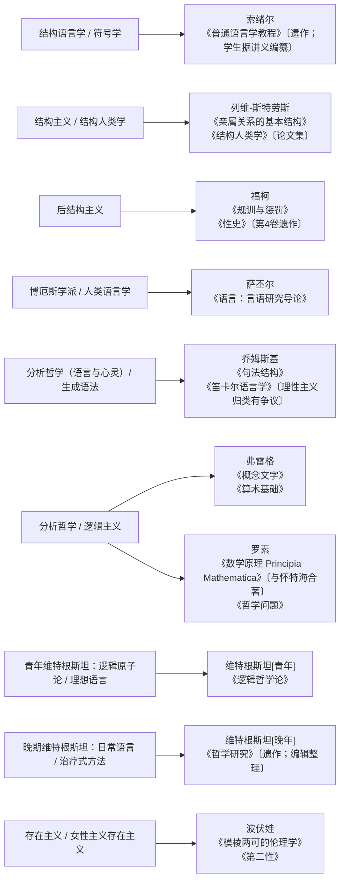

# 哲学家圆桌队列审查（第 2 组）

审查日期：2026-09-09  
唯一外部数据源：Wikipedia（只使用 `wikipedia.org` 页面）

## 审查口径

- “圆桌归属”优先采用 Wikipedia 人物条目 infobox 中明示的 `School/Tradition`，或 Wikipedia 的流派条目对人物作出的明确归类。
- 如果一个标签是后人追认、人物本人未使用、人物本人曾拒绝，均单列提示，不把它包装成无争议的自我认同。
- 作品只选 Wikipedia 明确列为重要、奠基性或直接展示该流派方法的 1–2 本；合著、遗作、讲义整理本、编辑成书均标明。
- 维特根斯坦按 Wikipedia 明确采用的 early / later 分期拆成两个席位。

## 建议入队映射（10 个席位）

| 圆桌席位 | 建议流派/传统 | 建议代表作 | Wikipedia 核验摘要与限制 | 已审查 Wikipedia 页面 |
|---|---|---|---|---|
| 索绪尔 | 结构语言学；符号学（semiology） | 《普通语言学教程》（*Course in General Linguistics*, 1916） | Wikipedia 称该书通常被视为结构语言学的起点，其语言/言语、能指/所指、共时/历时等框架奠定结构分析。**标签限制：**“结构主义”一词并非索绪尔本人使用；Wikipedia 的结构语言学条目称该词在他死后才由布拉格学派采用。**作品状态：**1916 年身后出版，由 Charles Bally 与 Albert Sechehaye 根据其 1906–1911 年日内瓦讲课笔记编纂；不是索绪尔亲自定稿的普通专著。 | [Ferdinand de Saussure](https://en.wikipedia.org/wiki/Ferdinand_de_Saussure)；[Course in General Linguistics](https://en.wikipedia.org/wiki/Course_in_General_Linguistics)；[Structural linguistics](https://en.wikipedia.org/wiki/Structural_linguistics) |
| 列维-斯特劳斯 | 结构主义；结构人类学 | 《亲属关系的基本结构》（*The Elementary Structures of Kinship*, 1949）；《结构人类学》（*Structural Anthropology*, 1958） | Wikipedia 将结构人类学定义为以列维-斯特劳斯 1949 年思想为基础的社会文化人类学学派；人物条目称他把索绪尔的结构语言学用于人类学。《亲属关系的基本结构》从结构角度研究亲属制度；《结构人类学》是论文集，既给出案例，也对结构主义作纲领性说明。 | [Claude Lévi-Strauss](https://en.wikipedia.org/wiki/Claude_L%C3%A9vi-Strauss)；[Structural anthropology](https://en.wikipedia.org/wiki/Structural_anthropology)；[Structuralism](https://en.wikipedia.org/wiki/Structuralism) |
| 福柯 | 后结构主义（同时属大陆哲学、法国尼采主义） | 《规训与惩罚》（*Discipline and Punish*, 1975）；《性史》（*The History of Sexuality*, 1976–2018） | 人物条目 infobox 把 Post-structuralism 列入其传统；两书集中体现权力—知识、规训、身体、话语、谱系学等主题。**标签争议：**Wikipedia 同时明确说福柯虽常被称为结构主义者和后现代主义者，却拒绝这些标签；因此不应把“结构主义/后现代主义”写成他的自我认同。**作品状态：**《性史》共四卷，前三卷在世时出版（1976、1984、1984），第四卷《肉欲忏悔》2018 年身后经编辑出版；Wikipedia 还指出福柯曾明确反对身后出版其作品。 | [Michel Foucault](https://en.wikipedia.org/wiki/Michel_Foucault)；[Discipline and Punish](https://en.wikipedia.org/wiki/Discipline_and_Punish)；[The History of Sexuality](https://en.wikipedia.org/wiki/The_History_of_Sexuality) |
| 萨丕尔 | 博厄斯学派人类学；人类语言学；语言相对论（弱式、谨慎归类） | 《语言：言语研究导论》（*Language: An Introduction to the Study of Speech*, 1921） | Wikipedia 的博厄斯学派条目把 Edward Sapir 明列为该学派代表；人物条目把 anthropological linguistics 与 linguistic relativity 列为其 known for，并称《语言》涵盖语言类型、语言漂移及语言—种族—文化关系。**标签限制：**“萨丕尔—沃尔夫假说”常被视为误称；二人从未以“假说”形式共同提出该理论，也未提出后来所谓强/弱二分。Wikipedia 还说 Sapir 明确反对强语言决定论，他本人更接近弱式语言相对论。 | [Edward Sapir](https://en.wikipedia.org/wiki/Edward_Sapir)；[Boasian anthropology](https://en.wikipedia.org/wiki/Boasian_anthropology)；[Linguistic relativity](https://en.wikipedia.org/wiki/Linguistic_relativity)；[Language: An Introduction to the Study of Speech](https://en.wikipedia.org/wiki/Language%3A_An_Introduction_to_the_Study_of_Speech) |
| 乔姆斯基 | 分析哲学（语言与心灵）；生成语法 | 《句法结构》（*Syntactic Structures*, 1957）；《笛卡尔语言学》（*Cartesian Linguistics*, 1966） | Wikipedia 称乔姆斯基通常被认为开启了生成语法研究传统；《句法结构》是其早期标志性著作。人物页也把他置于分析哲学和语言—心灵研究中，并说其立场“更接近理性主义”。**归类限制：**人物页 `School or tradition` 实际列的是无政府工团主义、自由意志社会主义等政治传统，因此哲学圆桌采用“分析哲学（语言与心灵）/生成语法”是依据正文研究领域作出的功能性归类，不是假装来自该栏。《笛卡尔语言学》对经典文献和“理性主义”历史的解释受到明确批评，不宜把“笛卡尔理性主义”写成无争议正式流派。 | [Noam Chomsky](https://en.wikipedia.org/wiki/Noam_Chomsky)；[Syntactic Structures](https://en.wikipedia.org/wiki/Syntactic_Structures)；[Cartesian Linguistics](https://en.wikipedia.org/wiki/Cartesian_Linguistics) |
| 弗雷格 | 分析哲学；逻辑主义；语言转向 | 《概念文字》（*Begriffsschrift*, 1879）；《算术基础》（*The Foundations of Arithmetic*, 1884） | Wikipedia 人物条目把 Analytic philosophy、Linguistic turn、Logicism 明列为其传统，并称他是分析哲学奠基人之一。《概念文字》开创严格的函数、变量和量化处理；《算术基础》被称为逻辑主义计划的奠基文本，也被 Michael Dummett 视为语言转向的定位点。**阶段提示：**Wikipedia infobox 另列其 1891 年前为 transcendental idealism、之后为 metaphysical realism；若系统以后细分弗雷格阶段，可再拆席，当前以其分析哲学/逻辑主义贡献为主。 | [Gottlob Frege](https://en.wikipedia.org/wiki/Gottlob_Frege)；[The Foundations of Arithmetic](https://en.wikipedia.org/wiki/The_Foundations_of_Arithmetic)；[Logicism](https://en.wikipedia.org/wiki/Logicism) |
| 罗素 | 分析哲学；逻辑主义；逻辑原子论 | 《数学原理》（*Principia Mathematica*, 1910–1913）；《哲学问题》（*The Problems of Philosophy*, 1912） | Wikipedia 称罗素是分析哲学创立者之一，并把逻辑原子论列为其重要思想；与 Whitehead 合著的三卷 *Principia Mathematica* 是经典逻辑和逻辑主义计划的奠基文本/里程碑，《哲学问题》集中呈现其认识论、亲知与描述知识。**作品状态：***Principia Mathematica* 是与 Alfred North Whitehead 合著，不能只署罗素；Wikipedia 也记录其为规避悖论而采用类型论，并指出该逻辑主义计划需要若干不显然是纯逻辑真理的公理，故不可描述为毫无问题地完成了数学向逻辑的还原。 | [Bertrand Russell](https://en.wikipedia.org/wiki/Bertrand_Russell)；[Principia Mathematica](https://en.wikipedia.org/wiki/Principia_Mathematica)；[The Problems of Philosophy](https://en.wikipedia.org/wiki/The_Problems_of_Philosophy) |
| 维特根斯坦[青年] | 分析哲学；逻辑原子论；理想语言哲学 | 《逻辑哲学论》（*Tractatus Logico-Philosophicus*, 1921） | Wikipedia 明确把其思想分为 early 与 later；青年阶段由《逻辑哲学论》代表，关注命题与世界的逻辑关系。人物条目 infobox 明列“Logical atomism (early period)”；作品条目也说其形而上学通常称为逻辑原子论。**标签限制：**“逻辑原子论”不是维特根斯坦本人使用的名称；他的版本与罗素的版本并不完全相同。不能把他写成维也纳学派成员或逻辑实证主义者：Wikipedia 明示他从未加入维也纳学派，只能说该书深刻影响了其中的逻辑实证主义者。**作品状态：**这是他生前出版的唯一一本篇幅完整的哲学著作。 | [Ludwig Wittgenstein](https://en.wikipedia.org/wiki/Ludwig_Wittgenstein)；[Tractatus Logico-Philosophicus](https://en.wikipedia.org/wiki/Tractatus_Logico-Philosophicus) |
| 维特根斯坦[晚年] | 分析哲学；日常语言哲学；治疗式方法；反基础主义/反本质主义 | 《哲学研究》（*Philosophical Investigations*, 1953） | Wikipedia 的分析哲学条目明确把战后日常语言哲学分为“后期维特根斯坦”和“牛津哲学”两支，并称晚期发展了治疗式方法。人物条目称晚期拒绝《逻辑哲学论》的许多前提，把词义理解为语言游戏中的使用。**作品状态：**1953 年身后出版；第一部分大多在 1946 年已接近付印但由本人撤回，第二部分由编辑 Elizabeth Anscombe 与 Rush Rhees 加入；作品条目说明手稿在 1951 年去世时尚未准备好出版。 | [Ludwig Wittgenstein](https://en.wikipedia.org/wiki/Ludwig_Wittgenstein)；[Philosophical Investigations](https://en.wikipedia.org/wiki/Philosophical_Investigations)；[Ordinary language philosophy](https://en.wikipedia.org/wiki/Ordinary_language_philosophy)；[Analytic philosophy](https://en.wikipedia.org/wiki/Analytic_philosophy) |
| 波伏娃 | 存在主义；存在主义现象学；女性主义存在主义；法国女性主义 | 《模棱两可的伦理学》（*The Ethics of Ambiguity*, 1947）；《第二性》（*The Second Sex*, 1949） | 人物条目 infobox 明列 Existentialism、Existential phenomenology、French feminism，并称她是法国存在主义哲学家；《模棱两可的伦理学》条目称其为存在主义伦理学著作及该领域核心贡献。《第二性》被人物条目称为女性主义哲学的开创性著作、当代女性主义的基础文本。**身份/标签限制：**Wikipedia 同时说波伏娃不认为自己是哲学家，当时也未被如此看待；她起初不愿称自己为女性主义者，曾多次否认，后来才接受这一身份。 | [Simone de Beauvoir](https://en.wikipedia.org/wiki/Simone_de_Beauvoir)；[The Ethics of Ambiguity](https://en.wikipedia.org/wiki/The_Ethics_of_Ambiguity)；[The Second Sex](https://en.wikipedia.org/wiki/The_Second_Sex)；[Feminist existentialism](https://en.wikipedia.org/wiki/Feminist_existentialism) |

## 可直接用于总 Mermaid 的队列片段

## 集成时必须保留的短注

1. 索绪尔：结构主义是后来的归类；《普通语言学教程》为身后讲义编纂本。
2. 福柯：Wikipedia 将后结构主义列入传统，但本人拒绝“结构主义者”和“后现代主义者”等标签。
3. 萨丕尔：不要把“强语言决定论”或正式共同提出的“萨丕尔—沃尔夫假说”归给他。
4. 罗素：*Principia Mathematica* 必须注明与怀特海合著。
5. 青年维特根斯坦：“逻辑原子论”是后来的通称，不是本人用语。
6. 晚年维特根斯坦：《哲学研究》为遗作且经编辑整理。
7. 波伏娃：哲学家/女性主义者身份均有本人早期拒绝或迟疑的历史，不能写成始终如一的自我标签。
